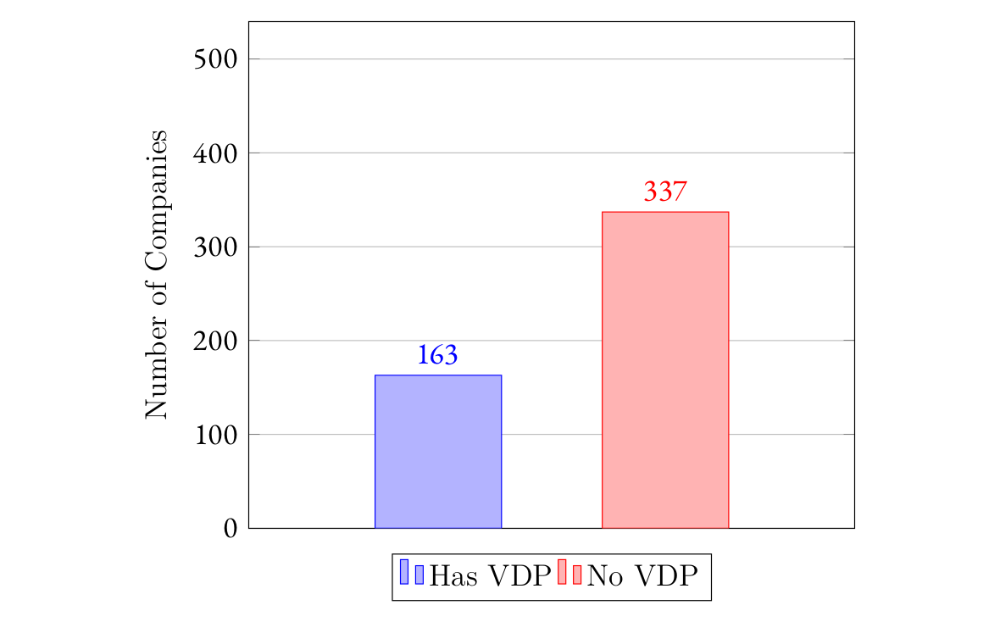
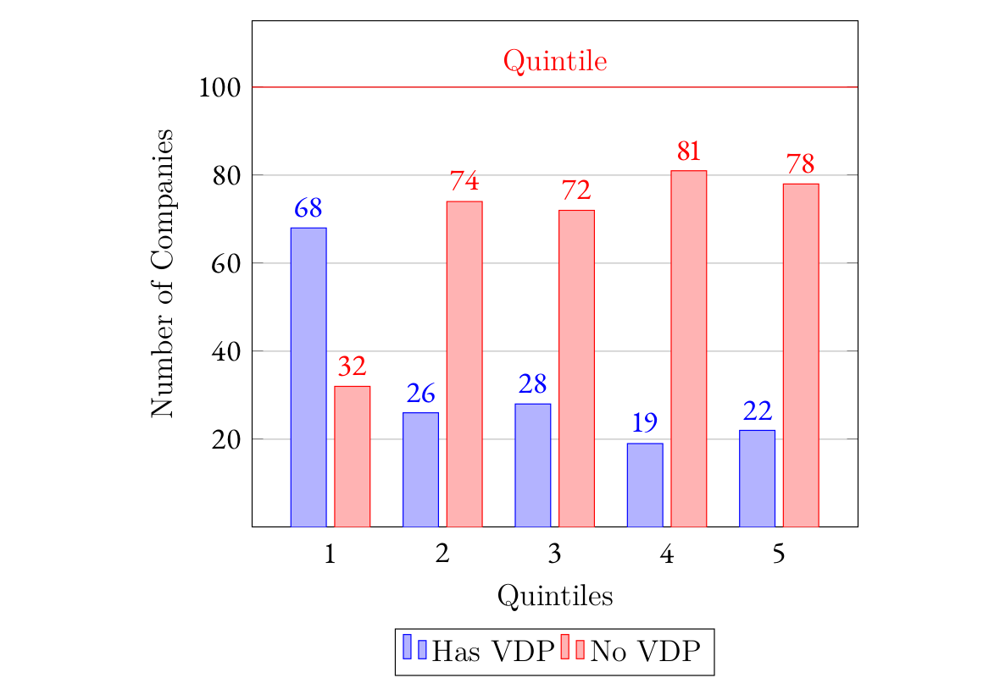

---

##### Download

+ [Paper](corporate-law-and-vulnerability-disclosure-polices.pdf)

---

##### Abstract

This paper explores the intersection of corporate law and cybersecurity through the lens of Vulnerability Disclosure Policies (VDPs). It underscores the increasing importance of these policies in protecting corporations from cyber threats by enabling ethical vulnerability reporting without legal repercussions for the reporters. Despite their potential to enhance cybersecurity, many corporations remain unaware or unconvinced of their necessity, thus exposing themselves to significant risks. The paper argues that corporate law should mandate the consideration and implementation of these policies due to their critical role in cybersecurity. It discusses the current state of cybersecurity threats, the various actors involved (white hat, black hat, and grey hat hackers), and the incentives driving these actors. Through empirical analysis of S&P 500 companies and the top 50 companies with the most disclosures in the Common Vulnerabilities and Exposures (CVE) system, the study finds a positive correlation between the implementation of VDPs and the frequency of vulnerability reporting, suggesting that these policies significantly improve corporate cybersecurity resilience. The paper concludes by advocating for statutory and regulatory changes to enforce the adoption of VDPs and safe harbor policies, aiming to help corporate law catch up with the technological realities of our times.

---

##### Figure 1:  Prevalence of VDPs in the S&P 500



##### Figure 2:  Prevalence of VDPs in the S&P 500 broken down to Quintiles




##### Figure 3:  Effect of VDPs on the Average increase of CVEs Per Year (Percent)


---

##### Citation

Shmuëli, Eran. 2024. "Corporate Law and Vulnerability Disclosure Policies." https://eranshmueli.com/papers/02/corporate-law-and-vulnerability-disclosure-polices.pdf.

```BibTeX
@article{S23,
author = {Eran Shmuëli},
year = {2023},
title ={Corporate Law and Vulnerability Disclosure Policies},
url = {https://eranshmueli.com/papers/02/corporate-law-and-vulnerability-disclosure-polices.pdf}}
```

<!--
---

##### Related material

+ [Working definition of Antisemitism](https://holocaustremembrance.com/resources/working-definition-antisemitism)
+ [UN Doc. A/C.6/SR.78](https://undocs.org/A/C.6/SR.78)
+ [UN Doc. E/447](https://digitallibrary.un.org/record/611058/files/E_447-EN.pdf)
+ [Genocide Convention](https://www.ohchr.org/en/instruments-mechanisms/instruments/convention-prevention-and-punishment-crime-genocide)
+ [_Bosnia and Herzegovina v. Serbia and Montenegro_, Judgment of 26 February 2007](https://icj-cij.org/sites/default/files/case-related/91/091-20070226-JUD-01-00-EN.pdf)
-->
